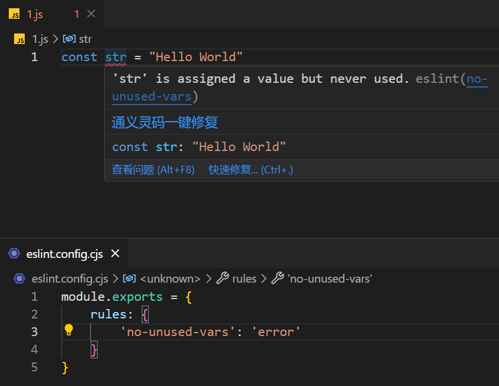

# [0004. 使用 no-unused-vars 配置规则：未使用的变量报错](https://github.com/Tdahuyou/eslint/tree/main/0004.%20%E4%BD%BF%E7%94%A8%20no-unused-vars%20%E9%85%8D%E7%BD%AE%E8%A7%84%E5%88%99%EF%BC%9A%E6%9C%AA%E4%BD%BF%E7%94%A8%E7%9A%84%E5%8F%98%E9%87%8F%E6%8A%A5%E9%94%99)


## 🔗 links

- https://eslint.org/docs/latest/rules/no-unused-vars - eslint 官方文档 no-unused-vars

## 📒 notes

- `no-unused-vars` 用于检测代码中未使用的变量、函数参数或导入的模块。通常情况下，对于一个模块中未使用的变量，程序中是不会报错的。
- **未被使用的变量对程序的逻辑并不会造成影响。**如果想要确保程序中不存在未使用的变量，可以通过 `no-unused-vars` 规则来检测并报错提示，然后再将这些提示的变量处理掉。

## 💻 demo - 'no-unused-vars': 'error'

```js
module.exports = {
    rules: {
        'no-unused-vars': 'error'
    }
}
```



## 🤖 AI - 请介绍一下 no-unused-var 配置

`no-unused-vars` 是 ESLint 中一个非常有用的规则，用于检测代码中未使用的变量、函数参数或导入的模块。这个规则有助于保持代码的整洁，避免不必要的声明，并且可以减少潜在的错误。

### 规则配置

在你的 ESLint 配置文件（例如 `.eslintrc.js` 或 `eslint.config.js`）中，你可以启用和自定义 `no-unused-vars` 规则。以下是一些常见的配置选项：

#### 基本启用
```javascript
module.exports = {
  rules: {
    'no-unused-vars': 'error' // 或者 'warn'
  }
};
```

这里 `'error'` 表示如果违反了这条规则，ESLint 会将其标记为错误；如果是 `'warn'`，则只会生成警告。

#### 自定义选项
`no-unused-vars` 规则支持多个选项来进一步定制其行为。这些选项可以通过数组形式传递给规则，其中第一个元素是错误级别（`error` 或 `warn`），第二个元素是一个对象，包含具体的配置选项。

##### 忽略模式
如果你希望忽略某些特定的变量名或模式，可以使用 `varsIgnorePattern` 和 `argsIgnorePattern` 选项：
```javascript
module.exports = {
  rules: {
    'no-unused-vars': ['error', { varsIgnorePattern: '^_', argsIgnorePattern: '^_' }]
  }
};
```
在这个例子中，所有以 `_` 开头的变量和函数参数将被忽略，不会触发 `no-unused-vars` 错误。

##### 忽略函数参数
有时候你可能需要保留一些函数参数，即使它们没有被使用，比如回调函数中的默认参数。你可以通过设置 `args` 选项来调整这一点：
```javascript
module.exports = {
  rules: {
    'no-unused-vars': ['error', { args: 'none' }]
  }
};
```
这会禁用对函数参数的检查。

##### 检查已解构的变量
默认情况下，`no-unused-vars` 不会检查解构赋值中的未使用变量。如果你想启用这项检查，可以设置 `destructuredArrayIgnorePattern` 和 `ignoreRestSiblings` 选项：
```javascript
module.exports = {
  rules: {
    'no-unused-vars': ['error', { destructuredArrayIgnorePattern: '^_' }]
  }
};
```
这样，除了那些匹配模式的解构变量外，其他未使用的解构变量都会触发错误。

##### 忽略导出的变量
有时你可能需要导出一些变量，即使它们在当前文件中没有被使用。你可以通过设置 `vars` 选项来调整这一点：
```javascript
module.exports = {
  rules: {
    'no-unused-vars': ['error', { vars: 'local' }]
  }
};
```
这会只检查局部变量，而忽略全局变量和导出的变量。

### 示例

假设你有如下 JavaScript 代码：
```javascript
function example(a, b) {
  console.log(a);
}

const unusedVar = 42;
```

如果没有配置 `no-unused-vars` 规则，这段代码会被认为是有效的。但是，当你启用了 `no-unused-vars` 规则后，ESLint 会报告 `b` 和 `unusedVar` 未被使用。

如果你想要忽略以 `_` 开头的变量，可以配置如下：
```javascript
module.exports = {
  rules: {
    'no-unused-vars': ['error', { argsIgnorePattern: '^_', varsIgnorePattern: '^_' }]
  }
};
```

然后修改代码：
```javascript
function example(_a, _b) {
  console.log(_a);
}

const _unusedVar = 42;
```

此时，ESLint 将不会报告 `_b` 和 `_unusedVar` 未被使用。

通过这样的配置，你可以根据项目的具体需求灵活地应用 `no-unused-vars` 规则。